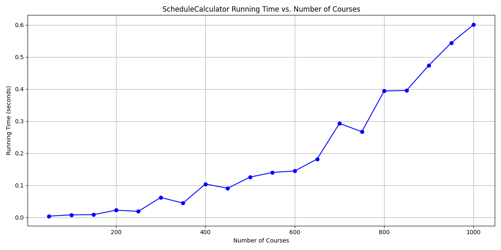

# 🎓 Course Recommendation System (Degree Planner)

A Python-based **course recommendation system** that suggests the **best set of courses to take next semester** to finish your degree requirements in the **fastest possible time**.

It models degree requirements and prerequisites as a **dependency graph**, then uses **Dijkstra’s algorithm** to find an optimal “shortest path” plan toward graduation (minimizing remaining requirement distance / steps).

---

## ✨ What this project does

- ✅ Reads a **course catalog** and **degree requirement** definitions
- ✅ Builds a **prerequisite / dependency graph** (courses → unlocked courses / requirements)
- ✅ Recommends the **best courses for the next term** to make the fastest progress
- ✅ Includes a **schedule calculator** and performance test visualization

---

## 🧠 How it works (high-level)

### 1) Data ingestion
The system loads:
- **Degree requirement JSON** (ex: CS BS, CS BA, Comp Eng BS)
- **General education course lists**
- **Course catalog CSV**
- **Term offerings CSVs** (Fall/Spring/Winter, etc.)

### 2) Build a dependency graph
Courses and requirements are represented as nodes, with edges capturing:
- prerequisites / requisites
- requirement dependencies (what unlocks what)
- progression constraints (must take X before Y)

### 3) Run Dijkstra’s algorithm
The planner treats “reaching graduation” as a goal state and uses **Dijkstra’s algorithm** to compute the shortest path / minimum-cost progression through remaining requirements.

### 4) Recommend “next semester” courses
From the shortest path (and any term constraints), the system outputs the most useful set of courses to take in the next term—i.e., the ones that unlock the most progress toward completing the degree fastest.

---

## 🗂️ Repository structure

```text
Course-Recommendation-System/
├── data/
│   ├── requirements/
│   │   ├── Computer_Engineering_BS.json
│   │   ├── Computer_Science_BA.json
│   │   └── Computer_Science_BS.json
│   ├── all_general_education_courses.json
│   ├── general_education_courses.json
│   ├── new_general_education_courses.json
│   ├── course_catalog.csv
│   ├── fall_2024.csv
│   ├── spring_2025.csv
│   ├── winter_2025.csv
│   └── sample_data.json
│
├── scripts/
│   ├── scrape_from_course_catalog.py
│   ├── scrape_from_degree_audits.py
│   ├── add_requisites.py
│   ├── transfer_requisites.py
│   ├── simplify_requisites.py
│   ├── add_gen_ed_courses.py
│   ├── add_gen_eds.py
│   ├── process_gen_eds.py
│   ├── get_gen_ed_courses.py
│   ├── add_credit_count_to_course.py
│   ├── delete_gen_eds_with_requisites_*.py
│   └── fix_dictionaries_in_requirements_*.py
│
├── src/
│   ├── app.py
│   ├── dependency_graph.py
│   ├── dijkstra_algorithm.py
│   └── schedule_calculator.py
│
├── static/
├── templates/
├── test/
├── requirements.txt
└── schedule_calculator_running_time.png
```

---

## 📊 Performance

The repo includes a benchmark plot showing how the schedule calculator runtime scales with the number of courses:



---

## 🚀 Setup & Run Locally

### 1) Create a virtual environment (recommended)

```bash
python -m venv .venv

# Windows:
.venv\Scripts\activate

# macOS/Linux:
source .venv/bin/activate
```
### 2) Install dependencies
```bash
pip install -r requirements.txt
```
### 3) Run The App
```bash
python src/app.py
```

---

## 🧪 Example Inputs (Data-Driven)

**Degree requirement files** live in:  
`data/requirements/`

**Catalog and term offerings** live in:  
`data/`

If you want to test quickly, start with:

- `data/sample_data.json`

- A degree plan JSON  
  - e.g. `Computer_Science_BS.json`

- A term offering CSV  
  - e.g. `spring_2025.csv`

---

## 🛠️ Scripts (Data Building / Cleanup)

The `scripts/` folder contains utilities for:

- Scraping course catalogs / degree audits  
- Adding or simplifying requisites  
- Generating general education mappings  
- Fixing requirement dictionaries  
- Augmenting courses with credit counts  

These scripts exist to make the dataset **maintainable** and **reproducible**.

---

## 🧩 Core Modules

### `dependency_graph.py`
Builds the prerequisite / requirement graph structure.

### `dijkstra_algorithm.py`
Finds the shortest / fastest path toward completing remaining requirements.

### `schedule_calculator.py`
Computes feasible course selections and evaluates timing + performance.

### `app.py`
Main entry point (CLI or web server depending on implementation).

---

## ✅ Roadmap Ideas (Optional Improvements)

- **Term-aware optimization**  
  *(only recommend courses actually offered next term)*

- **Credit-load constraints**  
  *(e.g., 12–18 credits per term)*

- **Multi-objective scoring**  
  *(fastest time + difficulty + instructor rating)*

- **Export plan to calendar / PDF**

- **Better UI for selecting degree + completed courses**
